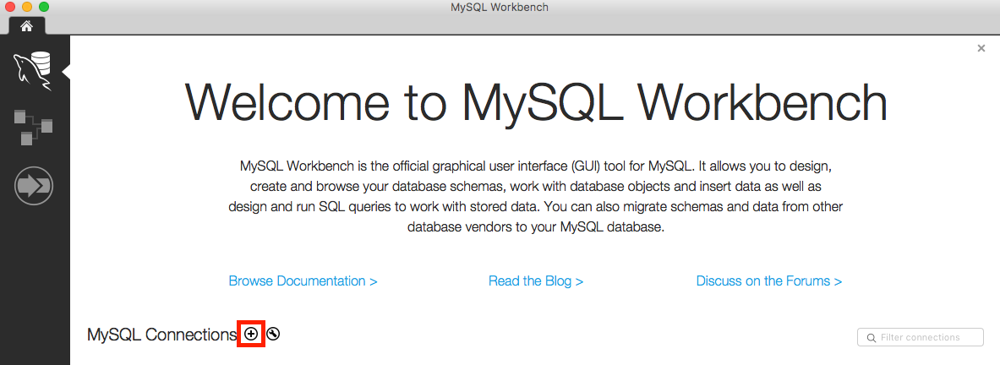
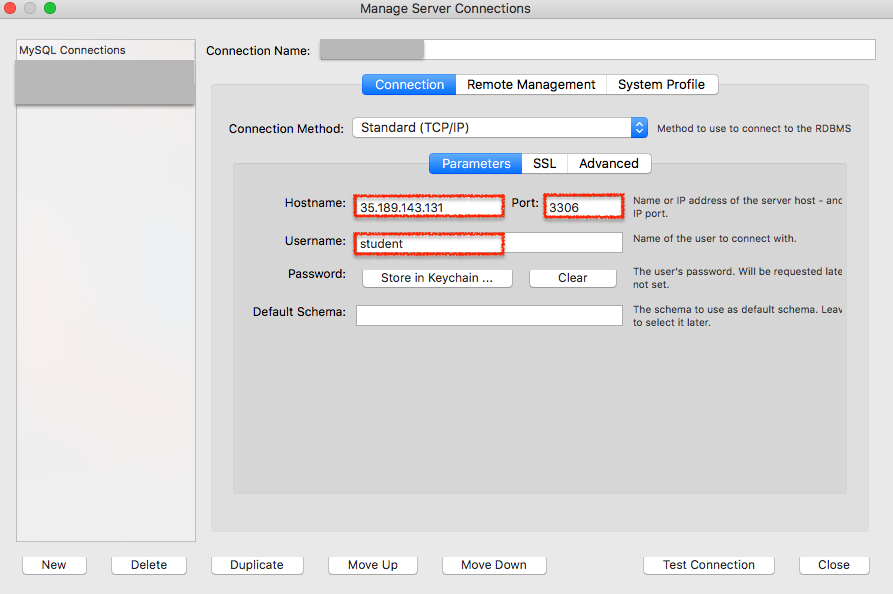
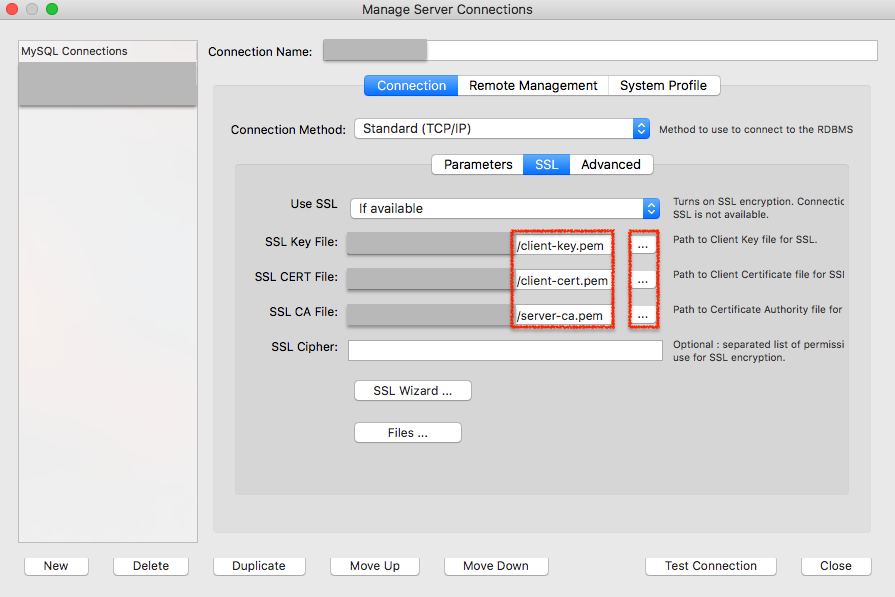
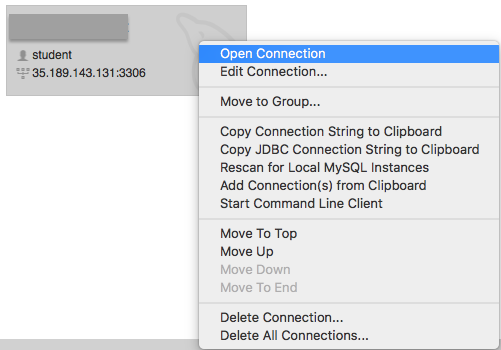
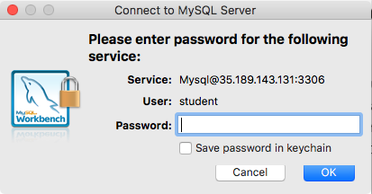
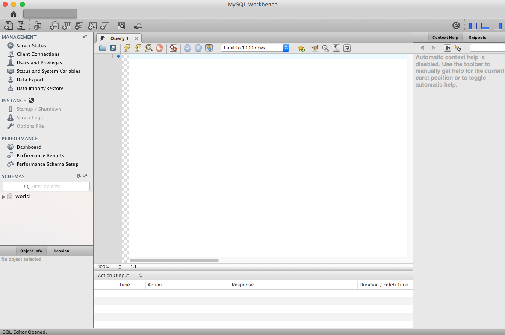
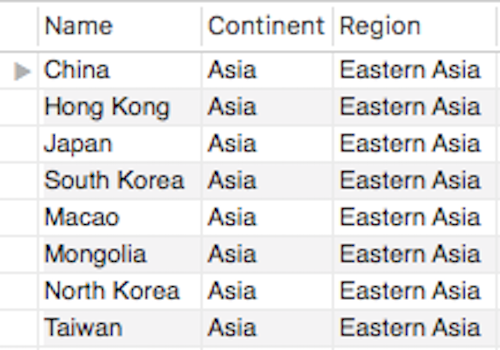
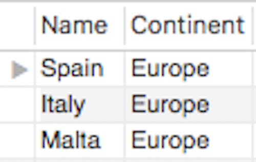
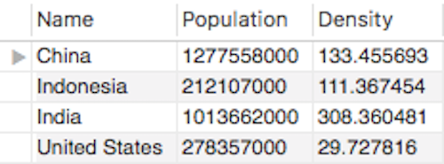

```{r setup, include=FALSE}
knitr::opts_chunk$set(echo = TRUE)
```

# 什麼是 SQL

## SQL 是縮寫

- Structured Query Language
- 查詢資料庫的語言

## 資料庫系統

- 商業
    - Microsoft SQL Server
    - Oracle
    - IBM DB2
- 開源
    - **MySQL**（這門課所使用的）
    - PostgreSQL
    - MongoDB

# 如何連結資料庫

## 下載 MySQL Workbench

- 請在這個連結下載：

<https://dev.mysql.com/downloads/workbench/>

## 下載憑證

- [SSL Key](https://storage.googleapis.com/csiersql/client-key.pem)
- [SSL CERT](https://storage.googleapis.com/csiersql/client-cert.pem)
- [SSL CA](https://storage.googleapis.com/csiersql/server-ca.pem)

## 設定連線資訊

- 新增連線



## 設定連線資訊

- Hostname: 35.189.143.131
- Port: 3306
- Username: student



## 設定連線資訊

- 依序將下載的憑證存放路徑輸入



## 設定連線資訊

- 雙擊連線或按右鍵開啟連線



## 設定連線資訊

- 輸入密碼



## 設定連線資訊

- Congrats, we are ALL set!



# SQL 指令

## `SHOW`

```
SHOW DATABASES;
```

## `USE` and `SHOW`

```
USE world;
SHOW TABLES;
```

## 階層關係

- 資料庫系統
    - 資料庫
        - 表格

# 基礎的 SQL 查詢

## 一個典型的 SQL 查詢結構

```
SELECT ...
  FROM ...
  WHERE ...
  GROUP BY ...
  HAVING ...
  ORDER BY ...
```

## `SELECT` 與 `FROM`

- `*` 意指**所有的欄位**

```
SELECT *
  FROM world.country;
```

或者

```
USE world;
SELECT *
  FROM country;
```

## `SELECT` 與 `FROM`（2）

- **（重要！）**養成先選幾列出來觀察的好習慣

```
SELECT *
  FROM world.country
  LIMIT 10;
```

## `SELECT` 與 `FROM`（3）

- 選指定的欄位

```
SELECT Name,
       Continent,
       Population
  FROM world.country;
```

## `SELECT` 與 `FROM`（4）

- `COUNT(*)` 計算表格有幾列

```
SELECT COUNT(*)
  FROM world.country;
```

## `SELECT` 與 `FROM`（4）

- 計算表格有幾個欄位

```
SELECT COUNT(*)
  FROM information_schema.columns
  WHERE table_name = 'country';
```

## `SELECT` 與 `FROM`（5）

- 計算衍生欄位

```
SELECT *, 
    Population/SurfaceArea AS Density
  FROM world.country;
```

## `WHERE`

- 把 `Taiwan` 選出來

```
SELECT *
  FROM world.country
  WHERE Name = 'Taiwan';
```

## `WHERE`（2）

- 選擇多個國家，使用 `IN` 這個關鍵字

```
SELECT *
  FROM world.country
  WHERE Name IN ('Taiwan', 'Japan', 'South Korea');
```

## `WHERE`（3）

- 負面表列，使用 `NOT IN` 這個關鍵字

```
SELECT *
  FROM world.country
  WHERE Continent NOT IN ('Asia', 'Africa', 'Oceania', 'Europe', 'Antarctica');
```

## `WHERE` （4）

- 使用 `>` 來找出人口超過 2 億的國家

```
SELECT *
  FROM world.country
  WHERE Population > 200000000;
```

## `WHERE` （5）

- 使用 `BETWEEN` 找出人口介於 100 與 1 萬的國家

```
SELECT *
  FROM world.country
  WHERE Population BETWEEN 100 AND 10000;
```

## `WHERE` （6）

- 使用 `LIKE` 與 `%` 對字串進行模糊比對
- United 開頭的國家

```
SELECT *
  FROM world.country
  WHERE Name LIKE 'United%';
```

## `WHERE`（7）

- 使用 `LIKE` 與 `%` 對字串進行模糊比對
- land 結尾的國家

```
SELECT *
  FROM world.country
  WHERE Name LIKE '%land';
```

## `WHERE`（8）

- 使用 `LIKE` 與 `%` 對字串進行模糊比對
- T 開頭 n 結尾的國家

```
SELECT *
  FROM world.country
  WHERE Name LIKE 'T%n';
```

## `WHERE`（9）

- 使用 `LIKE` 與 `_` 對字串進行模糊比對
- 找出剛好由四個字母組成的國家

```
SELECT *
  FROM world.country
  WHERE Name LIKE '____';
```

## `WHERE`（10）

- 使用 `AND` **交集**兩個以上的條件

```
SELECT *
  FROM world.country
  WHERE Name LIKE '____'
    AND Continent = 'Asia';
```

## `WHERE`（11）

- 使用 `OR` **聯集**兩個以上的條件

```
SELECT *
  FROM world.country
  WHERE Population > 200000000
    OR Population < 100;
```

## 隨堂練習

- 請寫出能夠產出以下結果的 SQL 查詢：



## 隨堂練習（2）

- 請寫出能夠產出以下結果的 SQL 查詢：



## 隨堂練習（3）

- 請寫出能夠產出以下結果的 SQL 查詢：

