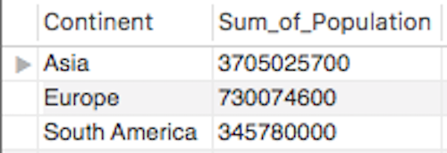
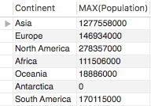
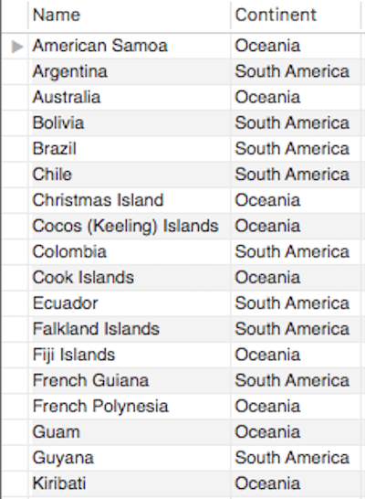

```{r setup, include=FALSE}
knitr::opts_chunk$set(echo = FALSE)
```

## 一個典型的 SQL 查詢結構

```
SELECT ...
  FROM ...
  WHERE ...
  GROUP BY ...
  HAVING ...
  ORDER BY ...
```

## `ORDER BY` 描述

- 可以選擇依照某一個欄位排序查詢結果
- 遞增排序：ASC
- 遞減排序：DESC
- 找出人口數排名前 10 的國家

```
SELECT Name
    ,Population
  FROM world.country
  ORDER BY Population DESC
  LIMIT 10;
```

## `ORDER BY` 描述（2）

- 找出歐洲土地面積最小的 10 個國家

```
SELECT Name
    ,SurfaceArea
  FROM world.country
  WHERE Continent = 'Europe'
  ORDER BY SurfaceArea ASC
  LIMIT 10;
```

## `SUM()` 函數

```
SELECT SUM(population) AS Sum_Pop
  FROM world.country;
```

## `DISTINCT()` 函數

- 回傳相異值

```
SELECT DISTINCT(continent)
  FROM world.country;
```

## `COUNT()` 函數

- 計算有多少國家的人口超過 1 億

```
SELECT COUNT(*)
  FROM world.country
  WHERE Population > 100000000;
```

## 其他常用聚合函數

- `AVG()`
- `MAX()`
- `MIN()`
- ...

## `GROUP BY`

- `SUM()` 函數加入 `GROUP BY` 敘述
- 計算各個 Continent 的人口總數

```
SELECT Continent
       ,SUM(population) AS Sum_Pop
  FROM world.country
  GROUP BY Continent;
```

## `GROUP BY`（2）

- `COUNT()` 函數加入 `GROUP BY` 敘述
- 計算各個 Continent 的國家數

```
SELECT Continent
       ,COUNT(*) AS Number_of_Countries
  FROM world.country
  GROUP BY Continent;
```

## `GROUP BY`（3）

- `COUNT()` 函數加入 `GROUP BY` 敘述
- 計算各個 Region 人口超過 1 千萬的國家數

```
SELECT Region
       ,COUNT(*) AS Number_of_Countries
  FROM world.country
  WHERE Population > 10000000
  GROUP BY Region;
```

## `HAVING`

- 針對聚合函數下條件
- 找出總人口數超過 1 億的洲（Continent）

```
/*錯誤*/
SELECT Continent
       ,SUM(Population) AS Sum_of_Population
  FROM world.country
  GROUP BY Continent
  WHERE Sum_of_Population > 100000000;
```

## `HAVING`（2）

- 針對聚合函數下條件
- 找出總人口數超過 1 億的洲（Continent）

```
/*正確*/
SELECT Continent
       ,SUM(Population) AS Sum_of_Population
  FROM world.country
  GROUP BY Continent
  Having Sum_of_Population > 100000000;
```

## 隨堂練習

- 請寫出能夠產出以下結果的 SQL 查詢：



## 隨堂練習（2）

- 請寫出能夠產出以下結果的 SQL 查詢：



## 子查詢

- `SELECT` **within** `SELECT`
- 找出人口數比美國多的國家：

```
SELECT Name
  FROM world.country
  WHERE Population > (
    SELECT Population
      FROM world.country
      WHERE Code = 'USA'
  );
```

## 子查詢（2）

- 找出跟 Brazil 屬於同一個洲的國家：

```
SELECT Name
  FROM world.country
  WHERE Continent = (
    SELECT Continent
      FROM world.country
      WHERE Name = 'Brazil'
  );
```

## 隨堂練習（3）

- 找出跟阿根廷（Argentina）或澳大利亞（Australia）同一個洲的國家，並以國家名稱排序：



## `JOIN` 描述

- 也許是關聯式資料庫最重要的技巧！
- 聯結的種類：
    - Inner Join（內部聯結）
    - Left Outer Join（左外部聯結）
    - Right Outer Join（右外部聯結）
    - Full Outer Join（全外部聯結）

## 內部聯結

- 取左表格跟右表格的交集

```
SELECT * FROM world.country
  WHERE Code IN ('TWN', 'JPN');
```